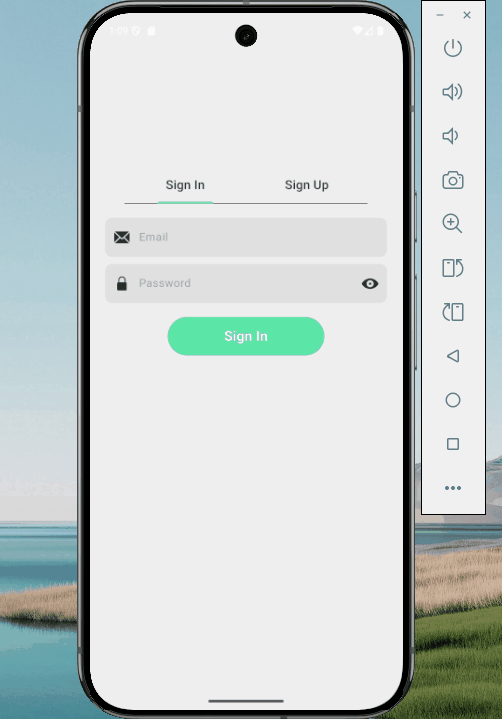
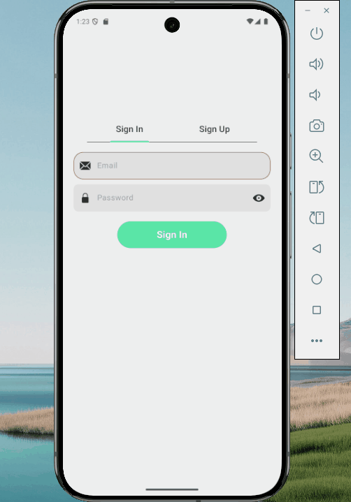
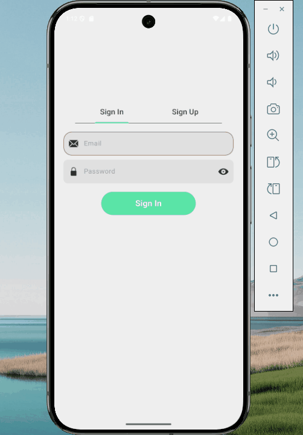
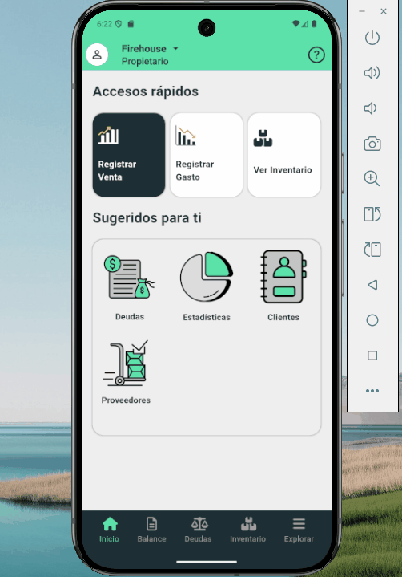

# 🏆 Smart Business Hub  
🚀 Desarrollo de una plataforma de gestión empresarial diseñada para administrar ingresos, egresos, clientes, proveedores, empleados y deudas. La aplicación incorpora autenticación de usuarios, almacenamiento seguro en Firebase y una arquitectura escalable basada en colecciones y subcolecciones para estructurar la información de cada empresa. 

## 📌 Características principales  
- **Autenticación segura** con BloC y validaciones avanzadas  
- **Onboarding interactivo** con transiciones suaves usando ConcentricPageView  
- **Navegación modular** con Provider y BottomAppBar personalizada  
- **Validación en tiempo real** de formularios para datos más confiables  

## 🎥 Demostraciones  

### 1️⃣ Onboarding intuitivo  
📌 *Transiciones dinámicas para mejorar la experiencia del usuario*  
  

### 2️⃣ Autenticación segura  
📌 *Gestión de estados con BloC y validaciones avanzadas*  

### 3️⃣ Barra de navegación eficiente  
📌 *Gestión de estados con Provider y transiciones fluidas*  
  

